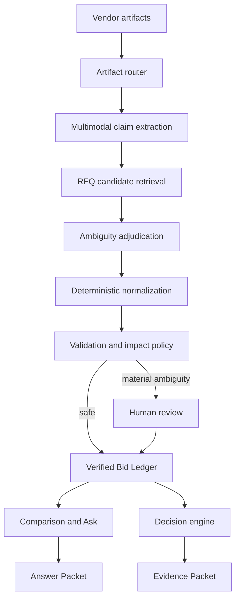

# QuoteIQ

**An evidence-backed AI quote compiler for enterprise procurement.**

QuoteIQ turns inconsistent supplier responses—emails, spreadsheets, PDFs,
documents and phone photographs—into a normalized, reviewable comparison. It
does not ask a buyer to trust a black box. Every important value stays connected
to its source, every decision-changing assumption requires approval, and every
answer can produce a reproducible evidence packet.

[](https://github.com/raajitkumar24/quoteiq/actions/workflows/ci.yml)
[](LICENSE)
[](package.json)

> QuoteIQ is a portfolio-grade reference implementation. Demo mode is fully
> deterministic and requires no model keys. Live mode exposes real Gemini and
> OpenAI integration points. Before production use, add your organization’s
> authentication, storage, security, procurement policies and evaluation gates.

## Product tour

The shipped demo is intentionally populated rather than starting from an empty
state. It models a corrugated-packaging RFQ with 30 requested lines, five vendor
responses, 204 extracted commercial facts and three decision-critical issues.
This makes it possible to inspect the complete trust workflow without first
uploading sample documents.

### 1. Command Center: understand decision readiness


The Command Center answers four questions before the buyer opens a spreadsheet:

- How much of the RFQ has been compiled?
- Which facts are verified, provisional or missing?
- Which issues can actually change the sourcing decision?
- Is the comparison ready for award analysis?

QuoteIQ deliberately separates extraction confidence from decision readiness.
For example, the sentence “freight extra at actuals” can be extracted with 99%
confidence while the comparison remains unsafe because the missing freight
amount can change the winning supplier.

### 2. Ask the verified comparison: Ask → Verify → Act


The conversational surface operates over the same Verified Bid Ledger as the
comparison table. It is not allowed to create a second, conversational version
of commercial truth. In the example above, the buyer asks, “Who is cheapest
after freight?” QuoteIQ:

1. scopes the question to five vendors, 30 RFQ lines, INR/kg and taxes excluded;
2. identifies normalized price, annual quantity and freight as required facts;
3. checks whether those facts are decision-ready;
4. retrieves approved Pune Zone 2 freight policy context;
5. calculates ranking counterfactuals deterministically; and
6. returns a provisional answer because the missing freight amount can move
   PackRight from rank #1 to rank #3.

The answer exposes its boundary instead of hiding uncertainty behind fluent
language. The buyer can apply an approved benchmark or request clarification.
Any approved resolution creates a new ledger version and recompiles the answer.

### 3. Award Scenarios: compare policies, not AI opinions


The decision engine generates feasible, policy-constrained options rather than
one opaque recommendation. The demo compares:

- **Lowest landed cost** — 100% BoxCo at ₹8.27M, with single-source exposure;
- **Fastest compliant** — 100% CorrPro at ₹8.62M, with a ₹350K premium; and
- **Balanced split** — blocked until PackRight freight is verified, because an
  optimizer must not treat missing freight as zero.

Deterministic services calculate eligibility, totals and allocations. The model
explains material trade-offs using those verified outputs. At AI Control Level
2, the system can prepare a scenario but cannot award a supplier.

### 4. Trust & Learning: improve without silent self-training


The Trust & Learning workspace follows a human correction through two separate
paths:

- **Operational path:** immediately update this RFQ's ledger, audit history,
  comparison and dependent scenarios.
- **Learning path:** classify the correction, create an evaluation case, replay
  regressions, shadow the candidate change and release it only inside a proven
  task boundary.

A single buyer action never modifies production model behavior. Different
signals are routed to different systems: fact corrections become extraction or
mapping evals, policy corrections improve retrieval and rules, preferences are
scoped to the user or organization, and one-off exceptions remain audit-only.

### 5. Documentation: business and technical context in the product

The Documentation tab explains product scope, the buyer journey, the Verified
Bid Ledger, model responsibilities, intervention logic, trust packets,
evaluation strategy, success metrics and deliberate non-goals. It is searchable
and links back into the product workflows it describes.

## At a glance

| Dimension | QuoteIQ approach |
|---|---|
| Primary user | Enterprise category buyer or procurement analyst |
| Core job | Turn heterogeneous vendor responses into a trusted comparison |
| Supported inputs | PDF, Excel, Word, email, scans, photographs and typed text |
| Canonical output | Versioned Verified Bid Ledger with source provenance |
| AI role | Extract, interpret, plan and explain |
| Deterministic role | Normalize, calculate, validate and optimize |
| Human role | Resolve material ambiguity and approve consequential actions |
| Main trust mechanism | Evidence + context + impact + human judgment |
| Autonomy model | Earned per task, constrained by policy and user permission |
| Reference modes | Keyless deterministic demo and provider-backed live mode |

## The problem

A buyer sends one RFQ to five suppliers and receives five different
“languages”: a beautiful spreadsheet that ignores the requested template, a PDF
with freight buried in a footnote, a commercial paragraph in Word, a phone photo
of a rate card and an email saying:

> ₹42/kg for the 5-ply, 38 for the 3-ply, rest same as last year, freight extra.

The buyer manually reconstructs commercial truth in a spreadsheet. This work is
slow, error-prone and difficult to audit. A conventional LLM parser makes the
workflow faster but introduces a new problem: a fluent answer can conceal a
wrong mapping, missing term or invented assumption.

QuoteIQ is designed around a different question:

> How can AI earn the right to participate in a consequential sourcing decision?

## Product thesis: a Quote Compiler

A compiler is a useful mental model:

| Compiler concept | QuoteIQ equivalent |
|---|---|
| Source language | PDF, Excel, email, document, scan or photograph |
| Parser | Multimodal commercial-claim extraction |
| Intermediate representation | Typed commercial claims |
| Linker | Vendor-line to RFQ-line matching |
| Type checker | UOM, currency, pack, tax and freight validation |
| Warning | Missing, ambiguous or contradictory term |
| Source map | Exact page, row, cell or sentence behind a value |
| Executable | Verified comparison and feasible award scenario |
| Incremental compilation | Revised supplier quotation and ledger version |

The system pipeline is:

```text
Vendor artifacts
  → source-grounded claims
  → canonical bid
  → validation and normalization
  → decision-impact review
  → Verified Bid Ledger
  → comparison, questions and award scenarios
```

The governing rule is simple:

> **AI may interpret. It may not silently invent.**

## End-to-end buyer journey

| Stage | Buyer experience | System responsibility | Trust control |
|---|---|---|---|
| 1. Ingest | Add the RFQ and vendor responses | Route each artifact by format, version and vendor | Immutable artifact record and checksum |
| 2. Extract | Watch supplier facts compile | Extract typed claims with exact source locators | Evidence must accompany every material claim |
| 3. Align | Review how vendor lines map to requested items | Retrieve candidates and adjudicate ambiguous matches | High-impact ambiguity cannot auto-finalize |
| 4. Normalize | Compare equivalent commercial values | Convert currency, UOM, pack size, discounts and freight basis | Deterministic arithmetic with transformation trace |
| 5. Validate | See coverage and readiness rather than one confidence score | Detect missing, contradictory, outlier and policy-sensitive facts | Missing is never silently converted to zero |
| 6. Resolve | Review only issues that can change the decision | Rank interventions by impact, policy and reversibility | Human approval creates a versioned mutation |
| 7. Compare | Inspect normalized bids and source evidence | Read from the Verified Bid Ledger | Cell-level provenance and verification status |
| 8. Ask | Ask a sourcing question in business language | Plan, retrieve, calculate and explain | Answer can be informational, provisional, decision-grade or blocked |
| 9. Decide | Compare feasible award scenarios | Generate policy-constrained allocations and trade-offs | AI prepares; the buyer approves |
| 10. Learn | Correct the system and record why | Route feedback into context, model, policy or exception workflows | No silent online learning |

### Claim lifecycle

Every extracted commercial claim moves through an explicit state machine:

```text
observed
  → interpreted
  → normalized
  → validated
  → verified | provisional | rejected
  → consumed by an answer or decision packet
```

- **Observed** preserves what the vendor actually said.
- **Interpreted** adds a typed commercial meaning without replacing the source.
- **Normalized** makes the value comparable and records every transformation.
- **Validated** checks schema, policy, consistency and decision impact.
- **Verified** is safe for the scoped use case.
- **Provisional** can be displayed only with a visible assumption or range.
- **Rejected** remains auditable but cannot influence calculation or ranking.

Verification is purpose-dependent. A fact may be good enough for a descriptive
summary but insufficient for supplier ranking or award preparation.

## What users can do

### 1. Compile supplier responses

The compiler accepts typed RFQ lines and supplier artifacts. In live mode,
Gemini extracts evidence-grounded claims while retaining the source quotation
and locator. In demo mode, a rich corrugated-packaging dataset is used.

### 2. Review only what matters

QuoteIQ does not ask a buyer to approve every extracted field. The intervention
policy considers:

```text
interpretation confidence × decision impact × policy × reversibility
```

An accurately extracted statement such as “freight extra” can still be
decision-critical because the missing amount changes supplier ranking.

### 3. Compare normalized bids

The comparison is a view over the Bid Ledger. Prices, freight, delivery,
payment terms, verification status and qualifications remain connected to their
source evidence and transformation.

### 4. Ask the verified comparison

The conversational surface is a workflow entry point, not a generic chatbot.
For every question the product:

1. scopes the question;
2. identifies required facts and constraints;
3. checks decision readiness;
4. retrieves approved evidence and policy context;
5. runs deterministic calculations or scenario logic;
6. returns an Answer Packet with evidence, assumptions and a decision boundary.

If missing evidence can change the result, the answer is blocked or
provisional.

### 5. Generate award scenarios

The deterministic decision engine produces comparable scenarios such as:

- lowest verified landed cost;
- fastest compliant supplier;
- lowest-cost diversified split under a concentration ceiling.

The AI explains trade-offs; it does not calculate totals or autonomously award
a supplier. Human approval remains mandatory at Control Level 2.

### 6. Learn through a guarded feedback loop

Human corrections update the current ledger immediately. Future model behavior
changes only after the correction is classified, converted into an evaluation
case, replayed against regression data, tested in shadow mode and released
within a narrow task boundary.

There is no silent online self-training from a buyer click.

## Ask the verified comparison in detail

### Query contract

Every query executes against an explicit scope:

- RFQ and ledger version;
- selected suppliers and requested lines;
- verified-only or qualified-fact policy;
- currency and unit basis;
- tax and freight treatment;
- effective date for policy and market context; and
- user role and permitted actions.

Conversational context can narrow a question, but it cannot silently alter a
ledger fact. A proposed assumption must be shown to the buyer and either remain
local to the answer or be approved as a versioned ledger mutation.

### Verified execution trace

The UI shows a concise, reproducible execution trace—not private model
chain-of-thought:

```text
question scope
  → required facts and constraints
  → decision-readiness check
  → approved evidence and context retrieval
  → deterministic calculation or scenario tool
  → counterfactual and safety check
  → Answer Packet
```

### Answer states

| State | When it is used | Product behavior |
|---|---|---|
| Informational | The request is descriptive and supported by evidence | Answer directly with cited facts |
| Provisional | A visible assumption or range is required | Show the dependency, sensitivity and resolution path |
| Decision-grade | All decision-critical inputs for this question are verified | Create a versioned Answer Packet |
| Blocked | Missing or conflicting evidence can materially change the result | Refuse a definitive answer and route the buyer to resolution |

### Governed actions

The conversational surface supports three action levels:

1. **Read** — inspect, explain, compare and calculate without changing state.
2. **Propose** — preview a benchmark, clarification request, saved view or award
   scenario.
3. **Commit** — require approval, create a new ledger version and record the
   mutation in the audit trail.

## Human-in-the-loop policy

QuoteIQ routes an issue to a person when one or more of the following is true:

- the interpretation is uncertain;
- the interpretation is reliable but the business context is incomplete;
- the fact can materially change ranking, compliance or allocation;
- enterprise policy explicitly requires approval;
- the action is difficult to reverse; or
- the current user has not granted the required autonomy.

A simplified intervention rule is:

```text
intervene when
  expected decision impact × unresolved uncertainty × policy weight
  exceeds the task-specific threshold
```

This prevents two common failure modes: reviewing every low-value extraction,
which destroys usability, and trusting every high-confidence extraction, which
ignores business impact.

## Trust architecture

### Verified Bid Ledger

The ledger is the canonical record connecting:

```text
what the supplier said
→ what the AI interpreted
→ how the value was normalized
→ what was verified
→ what a human changed
→ which decision used it
```

Every material update creates a new version and audit event.

### Decision readiness

Readiness is not a single opaque “AI confidence” score. QuoteIQ separates:

- quote-line coverage;
- commercial verification;
- technical compliance;
- unresolved assumptions;
- decision-critical issues.

A result becomes decision-grade only when the evidence required for that
specific decision is sufficient.

### Evidence and Answer Packets

Packets make results reproducible:

- source evidence and source locators;
- as-of-time context;
- deterministic transformations and calculations;
- visible assumptions;
- model, prompt and ledger version;
- counterfactuals and decision boundary;
- human approval or exclusion event.

### Progressive autonomy

Autonomy is earned task by task:

```text
demonstrated model capability
  ∩ enterprise policy
  ∩ user permission
  = actual autonomy
```

Currency conversion can be autonomous while supplier exclusion and award
approval remain human-controlled.

## Model and tool map

| Use case | Default model/tool | Why it is used | Control boundary |
|---|---|---|---|
| Mixed-layout document and image extraction | Gemini 2.5 Pro | Multimodal tables, scans, photos and commercial language | Cannot write directly to a decision |
| RFQ candidate retrieval | text-embedding-3-large | Efficient semantic shortlist | Similarity cannot finalize a match |
| Ambiguous mapping and term adjudication | GPT-5.4 | Strong contextual reasoning | High-impact ambiguity routes to review |
| Query planning and grounded explanation | GPT-5.4 | Converts intent into a typed plan and explains verified output | Cannot bypass readiness or policy |
| Currency, UOM, discounts, totals and landed cost | TypeScript deterministic services | Reproducible, testable arithmetic | No LLM arithmetic |
| Award allocation | Deterministic scenario engine; OR-Tools-compatible boundary | Feasible policy-constrained scenarios | Produces options, not awards |
| Intervention routing | Policy engine | Confidence, impact, policy and reversibility | Enterprise/user controls take precedence |

Model IDs are environment-configurable. The stable product layer is the ledger,
evidence schema, deterministic services, intervention policy and evaluations—not
a particular model.

## Architecture



See [Architecture](docs/architecture.md), [Trust layer](docs/trust-layer.md),
[Model routing](docs/model-routing.md), [API reference](docs/api.md) and
[Evaluation strategy](docs/evaluations.md).

## System layers and responsibilities

### 1. Artifact layer

Stores vendor, submission, version, MIME type, checksum and the original bytes.
Production implementations should keep artifacts immutable and apply malware
scanning, tenant isolation, retention and access policies before extraction.

### 2. Claim layer

Represents atomic supplier statements such as price, discount, freight,
delivery, tax, minimum order quantity or payment term. A claim carries its raw
quotation, locator, interpretation, confidence, extraction model and prompt
version.

### 3. Normalization layer

Converts comparable commercial values using deterministic functions. Supported
reference transformations include pack-to-unit price, quantity basis, explicit
currency rate, percentage discount and approved freight benchmark. Unknown
inputs remain unknown.

### 4. Validation and readiness layer

Checks schema validity, RFQ coverage, cross-field consistency, outliers,
technical compliance, commercial completeness and decision impact. It produces
typed issues and a decision-specific readiness result.

### 5. Verified Bid Ledger

Acts as the canonical, versioned commercial record consumed by tables, queries,
scenarios and packets. Material changes append audit events and create a linked
ledger version instead of mutating history in place.

### 6. Query and decision layer

Turns user intent into a typed query plan, enforces readiness and permission
checks, runs deterministic calculations or allocation logic and generates a
grounded explanation.

### 7. Evaluation and learning layer

Captures failures and human corrections with their as-of-time context. Candidate
improvements are tested offline, compared against baselines, shadowed and
released behind narrow task policies.

## Core domain model

| Entity | Purpose | Important fields |
|---|---|---|
| `RFQ` | Requested commercial and technical demand | lines, quantities, specifications, delivery locations |
| `VendorArtifact` | Immutable supplier submission | vendor, file, MIME type, checksum, version, timestamp |
| `CommercialClaim` | Atomic source-grounded statement | field, raw value, typed value, locator, confidence |
| `NormalizedValue` | Comparable deterministic value | value, unit, currency, transformation steps, inputs |
| `ReviewIssue` | Human-intervention object | type, severity, impact, evidence, resolution options |
| `LedgerEntry` | Canonical commercial fact | claim link, normalized value, status, approver, version |
| `LedgerVersion` | Immutable comparison snapshot | parent, mutations, effective time, audit events |
| `QueryPlan` | Typed execution plan for Ask | scope, required facts, constraints, tools, permissions |
| `AnswerPacket` | Reproducible conversational output | answer, evidence, calculations, assumptions, boundary |
| `AwardScenario` | Feasible policy-constrained option | allocation, landed cost, constraints, risks, eligibility |
| `EvidencePacket` | Defensible decision artifact | context, sources, transformations, models, approvals |
| `EvaluationCase` | Closed-loop learning record | input, expected behavior, failure class, versions, result |

The complete TypeScript definitions live in
[`lib/quoteiq/types.ts`](lib/quoteiq/types.ts).

## Demo mode and live mode

| Capability | Demo mode | Live mode |
|---|---|---|
| Input dataset | Rich synthetic corrugated-packaging RFQ | API-provided RFQ and vendor artifacts |
| Claim extraction | Deterministic fixtures | Gemini multimodal provider adapter |
| Query planning | Deterministic reference behavior | OpenAI reasoning provider adapter |
| Arithmetic and readiness | Production-shaped deterministic services | Same deterministic services |
| Award scenarios | Deterministic reference engine | Same engine with organization policies |
| Credentials | None | Server-side provider API keys |
| Intended use | Product walkthrough, development and tests | Integration experimentation before enterprise hardening |

Demo mode is not a visual mock. It runs the domain services and API contracts
with repeatable data so tests, screenshots and product walkthroughs remain
stable.

## Repository structure

```text
app/
  api/                 HTTP reference endpoints
  page.tsx             Interactive product prototype
lib/quoteiq/
  types.ts             Canonical RFQ, claim, ledger and packet types
  pipeline.ts          Demo/live compilation orchestration
  providers.ts         Gemini and OpenAI adapters
  normalization.ts     Deterministic commercial calculations
  readiness.ts         Decision-impact and HITL routing
  resolutions.ts       Human-approved ledger mutations
  decision-engine.ts   Feasible award scenario generation
  demo-engine.ts       Keyless deterministic demo behavior
  sample-data.ts       Rich synthetic RFQ and supplier data
prompts/               Versionable production prompt templates
tests/domain/          Trust, normalization and decision regression tests
docs/                  Product and technical documentation
```

## Quick start

### Prerequisites

- Node.js 22 or newer
- npm 10 or newer

### Run in demo mode

```bash
git clone https://github.com/raajitkumar24/quoteiq.git
cd quoteiq
npm ci
cp .env.example .env.local
npm run dev
```

Open the local URL shown by Vite. Demo mode requires no API keys and uses
deterministic sample data.

### Run the test suite

```bash
npm test
```

Tests cover:

- missing freight never becoming zero;
- explicit currency and pack normalization;
- decision-critical freight escalation;
- human benchmark and exclusion events;
- supplier eligibility propagation into award scenarios;
- production rendering and component integrity.

### Run with live models

Update `.env.local`:

```bash
QUOTEIQ_MODE=live
GOOGLE_AI_API_KEY=your_google_ai_key
OPENAI_API_KEY=your_openai_key
```

Optional model overrides:

```bash
QUOTEIQ_EXTRACTION_MODEL=gemini-2.5-pro
QUOTEIQ_REASONING_MODEL=gpt-5.4
QUOTEIQ_EMBEDDING_MODEL=text-embedding-3-large
```

Provider keys are read only in server-side modules. Never expose them through
`NEXT_PUBLIC_*` variables.

## API examples

```bash
curl http://localhost:3000/api/health

curl -X POST http://localhost:3000/api/compile \
  -H "content-type: application/json" \
  --data @examples/requests/compile.json
```

The exact request and response contracts are documented in
[docs/api.md](docs/api.md).

### Endpoint map

| Method | Endpoint | Purpose | Primary response |
|---|---|---|---|
| `GET` | `/api/health` | Inspect runtime mode, configured models and deterministic services | Health and configuration summary |
| `POST` | `/api/compile` | Compile RFQ lines and vendor artifacts into the ledger | Versioned Bid Ledger and readiness |
| `POST` | `/api/review` | Apply an approved benchmark or supplier exclusion | New ledger version and recalculated readiness |
| `POST` | `/api/scenarios` | Generate feasible award options from verified suppliers | Policy-constrained award scenarios |
| `POST` | `/api/ask` | Ask a grounded question over a ledger snapshot | Informational, provisional, decision-grade or blocked Answer Packet |

### Configuration reference

| Variable | Required | Default | Purpose |
|---|---:|---|---|
| `QUOTEIQ_MODE` | No | `demo` | Select deterministic demo behavior or live provider adapters |
| `GOOGLE_AI_API_KEY` | Live mode | — | Server-side credential for multimodal extraction |
| `OPENAI_API_KEY` | Live mode | — | Server-side credential for query planning and grounded explanation |
| `QUOTEIQ_EXTRACTION_MODEL` | No | `gemini-2.5-pro` | Override the extraction model identifier |
| `QUOTEIQ_REASONING_MODEL` | No | `gpt-5.4` | Override the reasoning model identifier |
| `QUOTEIQ_EMBEDDING_MODEL` | No | `text-embedding-3-large` | Override the retrieval embedding model identifier |

Configuration is loaded by [`lib/quoteiq/config.ts`](lib/quoteiq/config.ts).
Live mode fails closed when either required provider key is missing.

### API design boundaries

The reference endpoints intentionally keep transport logic thin. Domain
behavior lives under `lib/quoteiq/`, which makes it testable without HTTP and
replaceable by queues, workflows or service boundaries. A production API should
add authentication, authorization, tenant context, request IDs, idempotency,
payload limits, typed error codes, timeouts, retry policy and tracing.

## Live extraction input

An artifact can contain plain text or base64 data:

```json
{
  "id": "vendor-a-quote-v2",
  "vendorId": "vendor-a",
  "fileName": "quote.pdf",
  "mimeType": "application/pdf",
  "base64": "<base64-encoded-file>",
  "version": 2
}
```

Production deployments should add virus scanning, file-size limits, durable
object storage, document retention and tenant isolation before accepting
untrusted uploads.

## Prompt design

The repository keeps prompts outside UI code so they can be reviewed and
evaluated:

- [Commercial claim extraction](prompts/commercial-claim-extraction.md)
- [RFQ line matching](prompts/rfq-line-matching.md)
- [Verified query planning](prompts/verified-query-planner.md)
- [Grounded answer generation](prompts/grounded-answer.md)
- [Decision-impact review](prompts/decision-impact-review.md)

Prompt changes should be treated like code changes: version them, attach a
failure case and run regression evaluations before release.

## Evaluation strategy

Raw field accuracy is insufficient. QuoteIQ evaluates the full decision chain:

1. evidence extraction correctness;
2. semantic interpretation;
3. RFQ-line alignment;
4. normalization correctness;
5. comparison correctness;
6. decision correctness;
7. critical escalation recall.

The primary product metric is:

> **Decision-ready RFQs per buyer-hour**

Guardrail metrics include decision-impacting errors per RFQ, human
interventions per RFQ, provenance coverage, time to decision readiness,
recommendation override rate and autonomous actions later reversed.

### Evaluation layers

| Layer | Example metric | Why it matters |
|---|---|---|
| Evidence extraction | Field accuracy and exact-source support | A correct-looking value without evidence is not defensible |
| Semantic interpretation | Freight, tax and payment-term classification | Commercial language is contextual rather than purely structural |
| RFQ alignment | Candidate recall and final line-match precision | A correct price on the wrong requested item is still wrong |
| Normalization | Exact arithmetic agreement | Unit, currency and discount errors propagate into every decision |
| Intervention policy | Critical escalation recall | Decision-changing uncertainty must reach a person |
| Comparison | Vendor ranking accuracy under verified facts | The normalized ledger must produce the right ordering |
| Decision engine | Feasibility and objective agreement | Scenarios must obey qualification and allocation constraints |
| Grounded answer | Evidence coverage, boundary correctness and action safety | Fluent answers must not overstate readiness |
| Closed-loop release | Regression delta and shadow performance | A local correction must not create global degradation |

### Required test classes

- **Golden cases:** representative quote layouts, categories and commercial
  terms with reviewed expected outputs.
- **Adversarial cases:** conflicting footnotes, OCR noise, misleading table
  headers, hidden discounts and prompt-injection attempts inside artifacts.
- **Counterfactual cases:** inputs where one missing fact changes ranking or
  makes an allocation infeasible.
- **Regression cases:** every production failure and material human correction.
- **Policy cases:** organization-specific approval, exclusion and autonomy
  boundaries.
- **End-to-end replay:** as-of-time reconstruction from artifact ingestion to
  comparison, answer and award packet.

### Release gates

A candidate behavior should progress from offline evaluation to shadow traffic,
then to a narrowly scoped release. Consequential automation should require:

- task-level accuracy above the approved threshold;
- 100% recall on defined critical-escalation cases;
- zero unresolved decision-impacting errors in the release sample;
- no regression beyond tolerance on protected categories;
- named policy and model-risk approval; and
- a rollback path tied to model, prompt, policy and tool versions.

The current automated suite covers deterministic normalization, readiness,
human resolutions, award eligibility, rendered product metadata and component
integrity. Run both linting and tests before opening a pull request:

```bash
npm run lint
npm test
```

## Observability and auditability

Production traces should correlate the complete decision path without storing
private model reasoning:

```text
request ID
  → artifact and claim IDs
  → model and prompt versions
  → retrieved context and policy versions
  → deterministic tool inputs and outputs
  → readiness result and intervention
  → ledger / packet version
  → human decision and downstream action
```

Recommended operational signals include extraction latency, provider error
rate, schema-repair rate, unresolved claims by category, intervention volume,
time to decision readiness, answer-state distribution, scenario infeasibility
reasons, override rate and cost per decision-ready RFQ.

## Scope and non-goals

This repository focuses on the hardest, highest-value wedge:

```text
existing RFQ + messy supplier responses
→ trusted comparison
→ grounded analysis
→ human-approved award scenario
```

It does not implement supplier discovery, RFQ authoring, vendor outreach,
reverse auctions, autonomous negotiation, contract management or purchase-order
creation.

## Productionization checklist

Before enterprise use, add:

- SSO, RBAC, tenant isolation and approval roles;
- durable encrypted artifact and ledger storage;
- malware scanning, upload quotas and retention policies;
- category-specific ontologies and UOM conversion masters;
- approved FX, tax, freight and supplier-performance context sources;
- prompt-injection defenses and model-provider privacy controls;
- queueing, retries, idempotency and observability;
- golden datasets, shadow evaluation and release gates;
- legal, security, procurement and model-risk approval.

## License

QuoteIQ is released under the [MIT License](LICENSE).

## Author

Built by [Raajit Kumar](https://github.com/raajitkumar24) as an exploration of
how enterprise AI products can establish trust, preserve evidence and earn
progressive autonomy.
