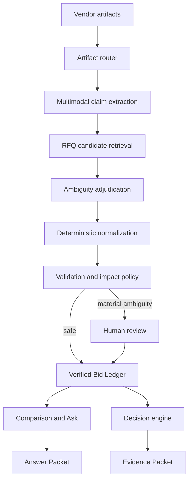

# QuoteIQ

**An evidence-backed AI quote compiler for enterprise procurement.**

QuoteIQ turns inconsistent supplier responses—emails, spreadsheets, PDFs,
documents and phone photographs—into a normalized, reviewable comparison. It
does not ask a buyer to trust a black box. Every important value stays connected
to its source, every decision-changing assumption requires approval, and every
answer can produce a reproducible evidence packet.

[](https://github.com/raajitkumar24/quoteiq/actions/workflows/ci.yml)
[](LICENSE)
[](package.json)

> QuoteIQ is a portfolio-grade reference implementation. Demo mode is fully
> deterministic and requires no model keys. Live mode exposes real Gemini and
> OpenAI integration points. Before production use, add your organization’s
> authentication, storage, security, procurement policies and evaluation gates.

## Product tour


The shipped demo is intentionally populated rather than starting from an empty
state. From this Command Center, the interview walkthrough continues through:

1. **Review Issues** — inspect the exact source evidence, business impact and
   resolution options for ambiguous freight, product mappings and inherited
   pricing.
2. **Compare Bids** — ask a question over the Verified Bid Ledger, watch the
   observable execution trace, resolve a blocking assumption and inspect the
   resulting Answer Packet.
3. **Award Scenarios** — compare deterministic lowest-cost, fastest-compliant
   and diversified award options using verified facts only.
4. **Trust & Learning** — follow a human correction from evidence packet to
   ledger update, audit event, evaluation case and earned-autonomy policy.
5. **Documentation** — search both business and technical product
   documentation without leaving the application.

## The problem

A buyer sends one RFQ to five suppliers and receives five different
“languages”: a beautiful spreadsheet that ignores the requested template, a PDF
with freight buried in a footnote, a commercial paragraph in Word, a phone photo
of a rate card and an email saying:

> ₹42/kg for the 5-ply, 38 for the 3-ply, rest same as last year, freight extra.

The buyer manually reconstructs commercial truth in a spreadsheet. This work is
slow, error-prone and difficult to audit. A conventional LLM parser makes the
workflow faster but introduces a new problem: a fluent answer can conceal a
wrong mapping, missing term or invented assumption.

QuoteIQ is designed around a different question:

> How can AI earn the right to participate in a consequential sourcing decision?

## Product thesis: a Quote Compiler

A compiler is a useful mental model:

| Compiler concept | QuoteIQ equivalent |
|---|---|
| Source language | PDF, Excel, email, document, scan or photograph |
| Parser | Multimodal commercial-claim extraction |
| Intermediate representation | Typed commercial claims |
| Linker | Vendor-line to RFQ-line matching |
| Type checker | UOM, currency, pack, tax and freight validation |
| Warning | Missing, ambiguous or contradictory term |
| Source map | Exact page, row, cell or sentence behind a value |
| Executable | Verified comparison and feasible award scenario |
| Incremental compilation | Revised supplier quotation and ledger version |

The system pipeline is:

```text
Vendor artifacts
  → source-grounded claims
  → canonical bid
  → validation and normalization
  → decision-impact review
  → Verified Bid Ledger
  → comparison, questions and award scenarios
```

The governing rule is simple:

> **AI may interpret. It may not silently invent.**

## What users can do

### 1. Compile supplier responses

The compiler accepts typed RFQ lines and supplier artifacts. In live mode,
Gemini extracts evidence-grounded claims while retaining the source quotation
and locator. In demo mode, a rich corrugated-packaging dataset is used.

### 2. Review only what matters

QuoteIQ does not ask a buyer to approve every extracted field. The intervention
policy considers:

```text
interpretation confidence × decision impact × policy × reversibility
```

An accurately extracted statement such as “freight extra” can still be
decision-critical because the missing amount changes supplier ranking.

### 3. Compare normalized bids

The comparison is a view over the Bid Ledger. Prices, freight, delivery,
payment terms, verification status and qualifications remain connected to their
source evidence and transformation.

### 4. Ask the verified comparison

The conversational surface is a workflow entry point, not a generic chatbot.
For every question the product:

1. scopes the question;
2. identifies required facts and constraints;
3. checks decision readiness;
4. retrieves approved evidence and policy context;
5. runs deterministic calculations or scenario logic;
6. returns an Answer Packet with evidence, assumptions and a decision boundary.

If missing evidence can change the result, the answer is blocked or
provisional.

### 5. Generate award scenarios

The deterministic decision engine produces comparable scenarios such as:

- lowest verified landed cost;
- fastest compliant supplier;
- lowest-cost diversified split under a concentration ceiling.

The AI explains trade-offs; it does not calculate totals or autonomously award
a supplier. Human approval remains mandatory at Control Level 2.

### 6. Learn through a guarded feedback loop

Human corrections update the current ledger immediately. Future model behavior
changes only after the correction is classified, converted into an evaluation
case, replayed against regression data, tested in shadow mode and released
within a narrow task boundary.

There is no silent online self-training from a buyer click.

## Trust architecture

### Verified Bid Ledger

The ledger is the canonical record connecting:

```text
what the supplier said
→ what the AI interpreted
→ how the value was normalized
→ what was verified
→ what a human changed
→ which decision used it
```

Every material update creates a new version and audit event.

### Decision readiness

Readiness is not a single opaque “AI confidence” score. QuoteIQ separates:

- quote-line coverage;
- commercial verification;
- technical compliance;
- unresolved assumptions;
- decision-critical issues.

A result becomes decision-grade only when the evidence required for that
specific decision is sufficient.

### Evidence and Answer Packets

Packets make results reproducible:

- source evidence and source locators;
- as-of-time context;
- deterministic transformations and calculations;
- visible assumptions;
- model, prompt and ledger version;
- counterfactuals and decision boundary;
- human approval or exclusion event.

### Progressive autonomy

Autonomy is earned task by task:

```text
demonstrated model capability
  ∩ enterprise policy
  ∩ user permission
  = actual autonomy
```

Currency conversion can be autonomous while supplier exclusion and award
approval remain human-controlled.

## Model and tool map

| Use case | Default model/tool | Why it is used | Control boundary |
|---|---|---|---|
| Mixed-layout document and image extraction | Gemini 2.5 Pro | Multimodal tables, scans, photos and commercial language | Cannot write directly to a decision |
| RFQ candidate retrieval | text-embedding-3-large | Efficient semantic shortlist | Similarity cannot finalize a match |
| Ambiguous mapping and term adjudication | GPT-5.4 | Strong contextual reasoning | High-impact ambiguity routes to review |
| Query planning and grounded explanation | GPT-5.4 | Converts intent into a typed plan and explains verified output | Cannot bypass readiness or policy |
| Currency, UOM, discounts, totals and landed cost | TypeScript deterministic services | Reproducible, testable arithmetic | No LLM arithmetic |
| Award allocation | Deterministic scenario engine; OR-Tools-compatible boundary | Feasible policy-constrained scenarios | Produces options, not awards |
| Intervention routing | Policy engine | Confidence, impact, policy and reversibility | Enterprise/user controls take precedence |

Model IDs are environment-configurable. The stable product layer is the ledger,
evidence schema, deterministic services, intervention policy and evaluations—not
a particular model.

## Architecture



See [Architecture](docs/architecture.md), [Trust layer](docs/trust-layer.md),
[Model routing](docs/model-routing.md), [API reference](docs/api.md) and
[Evaluation strategy](docs/evaluations.md).

## Repository structure

```text
app/
  api/                 HTTP reference endpoints
  page.tsx             Interactive product prototype
lib/quoteiq/
  types.ts             Canonical RFQ, claim, ledger and packet types
  pipeline.ts          Demo/live compilation orchestration
  providers.ts         Gemini and OpenAI adapters
  normalization.ts     Deterministic commercial calculations
  readiness.ts         Decision-impact and HITL routing
  resolutions.ts       Human-approved ledger mutations
  decision-engine.ts   Feasible award scenario generation
  demo-engine.ts       Keyless deterministic demo behavior
  sample-data.ts       Rich synthetic RFQ and supplier data
prompts/               Versionable production prompt templates
tests/domain/          Trust, normalization and decision regression tests
docs/                  Product and technical documentation
```

## Quick start

### Prerequisites

- Node.js 22 or newer
- npm 10 or newer

### Run in demo mode

```bash
git clone https://github.com/raajitkumar24/quoteiq.git
cd quoteiq
npm ci
cp .env.example .env.local
npm run dev
```

Open the local URL shown by Vite. Demo mode requires no API keys and uses
deterministic sample data.

### Run the test suite

```bash
npm test
```

Tests cover:

- missing freight never becoming zero;
- explicit currency and pack normalization;
- decision-critical freight escalation;
- human benchmark and exclusion events;
- supplier eligibility propagation into award scenarios;
- production rendering and component integrity.

### Run with live models

Update `.env.local`:

```bash
QUOTEIQ_MODE=live
GOOGLE_AI_API_KEY=your_google_ai_key
OPENAI_API_KEY=your_openai_key
```

Optional model overrides:

```bash
QUOTEIQ_EXTRACTION_MODEL=gemini-2.5-pro
QUOTEIQ_REASONING_MODEL=gpt-5.4
QUOTEIQ_EMBEDDING_MODEL=text-embedding-3-large
```

Provider keys are read only in server-side modules. Never expose them through
`NEXT_PUBLIC_*` variables.

## API examples

```bash
curl http://localhost:3000/api/health

curl -X POST http://localhost:3000/api/compile \
  -H "content-type: application/json" \
  --data @examples/requests/compile.json
```

The exact request and response contracts are documented in
[docs/api.md](docs/api.md).

## Live extraction input

An artifact can contain plain text or base64 data:

```json
{
  "id": "vendor-a-quote-v2",
  "vendorId": "vendor-a",
  "fileName": "quote.pdf",
  "mimeType": "application/pdf",
  "base64": "<base64-encoded-file>",
  "version": 2
}
```

Production deployments should add virus scanning, file-size limits, durable
object storage, document retention and tenant isolation before accepting
untrusted uploads.

## Prompt design

The repository keeps prompts outside UI code so they can be reviewed and
evaluated:

- [Commercial claim extraction](prompts/commercial-claim-extraction.md)
- [RFQ line matching](prompts/rfq-line-matching.md)
- [Verified query planning](prompts/verified-query-planner.md)
- [Grounded answer generation](prompts/grounded-answer.md)
- [Decision-impact review](prompts/decision-impact-review.md)

Prompt changes should be treated like code changes: version them, attach a
failure case and run regression evaluations before release.

## Evaluation strategy

Raw field accuracy is insufficient. QuoteIQ evaluates the full decision chain:

1. evidence extraction correctness;
2. semantic interpretation;
3. RFQ-line alignment;
4. normalization correctness;
5. comparison correctness;
6. decision correctness;
7. critical escalation recall.

The primary product metric is:

> **Decision-ready RFQs per buyer-hour**

Guardrail metrics include decision-impacting errors per RFQ, human
interventions per RFQ, provenance coverage, time to decision readiness,
recommendation override rate and autonomous actions later reversed.

## Scope and non-goals

This repository focuses on the hardest, highest-value wedge:

```text
existing RFQ + messy supplier responses
→ trusted comparison
→ grounded analysis
→ human-approved award scenario
```

It does not implement supplier discovery, RFQ authoring, vendor outreach,
reverse auctions, autonomous negotiation, contract management or purchase-order
creation.

## Productionization checklist

Before enterprise use, add:

- SSO, RBAC, tenant isolation and approval roles;
- durable encrypted artifact and ledger storage;
- malware scanning, upload quotas and retention policies;
- category-specific ontologies and UOM conversion masters;
- approved FX, tax, freight and supplier-performance context sources;
- prompt-injection defenses and model-provider privacy controls;
- queueing, retries, idempotency and observability;
- golden datasets, shadow evaluation and release gates;
- legal, security, procurement and model-risk approval.

## License

QuoteIQ is released under the [MIT License](LICENSE).

## Author

Built by [Raajit Kumar](https://github.com/raajitkumar24) as an exploration of
how enterprise AI products can establish trust, preserve evidence and earn
progressive autonomy.
